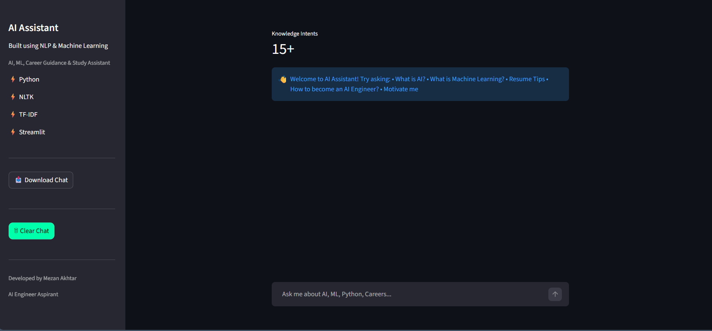
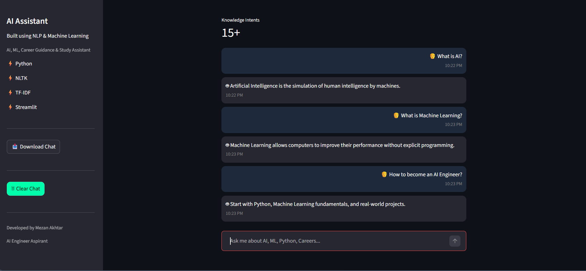

# AI Assistant Chatbot

NLP-powered conversational chatbot built using Python, NLTK, TF-IDF, and Streamlit for AI learning, career guidance, and study assistance.

---

## Live Demo

🔗 https://mezan-ai-assistant.streamlit.app

---

## Overview

AI Assistant Chatbot is an NLP-based conversational chatbot developed using Python, NLTK, TF-IDF, and Streamlit.

The chatbot can answer questions related to:

* Artificial Intelligence
* Machine Learning
* Deep Learning
* Python Programming
* Data Science
* Career Guidance
* Resume Tips
* Motivation
* General Knowledge Queries

The project demonstrates core Natural Language Processing concepts including text preprocessing, intent recognition, and conversational AI.

---

## Highlights

* NLP-based Intent Recognition
* TF-IDF Text Vectorization
* Interactive Streamlit Web Interface
* AI & Machine Learning Knowledge Assistant
* Career Guidance Support
* Resume Tips Assistance
* Motivation and Joke Responses
* Downloadable Chat History
* Modern User-Friendly Design

---

## Features

* Interactive chatbot interface
* Intent-based question answering
* AI and Machine Learning knowledge support
* Career guidance assistance
* Resume tips and study guidance
* Motivation and joke responses
* Developer information section
* Download chat history
* Typing animation effect
* Timestamped conversations
* Responsive Streamlit user interface

---

## Tech Stack

* Python
* NLTK (Natural Language Processing)
* TF-IDF Vectorization
* Streamlit
* JSON

---

## Project Structure

```text
AI-Assistant-Chatbot/
│
├── app.py
├── chatbot.py
├── intents.json
├── requirements.txt
├── README.md
├── .gitignore
├── LICENSE
└── setup.py
```

---

## How to Run

### 1. Clone the Repository

```bash
git clone https://github.com/mezanakhtar/ai-assistant-chatbot.git
```

### 2. Navigate to Project Folder

```bash
cd ai-assistant-chatbot
```

### 3. Install Dependencies

```bash
pip install -r requirements.txt
```

### 4. Run the Application

```bash
streamlit run app.py
```

### 5. Open in Browser

```text
http://localhost:8501
```

---

## 📸 Screenshots

### Homepage



### Chatbot Conversation



---

## Future Improvements

* Gemini API Integration
* OpenAI API Integration
* Voice-Based Interaction
* Context-Aware Conversations
* Multi-language Support
* Database Integration
* User Authentication
* Chat Analytics Dashboard

---

## Learning Outcomes

Through this project, I gained practical experience in:

* Natural Language Processing (NLP)
* Intent Recognition
* Text Vectorization using TF-IDF
* Python Application Development
* Streamlit UI Development
* Git & GitHub Version Control
* Project Documentation

---

## Author

### Mezan Akhtar

Artificial Intelligence & Machine Learning Graduate | Aspiring AI Engineer 

#### Skills

* Python
* Machine Learning
* Natural Language Processing (NLP)
* Generative AI
* Streamlit

#### GitHub

https://github.com/mezanakhtar

---

## License

This project is licensed under the MIT License.
